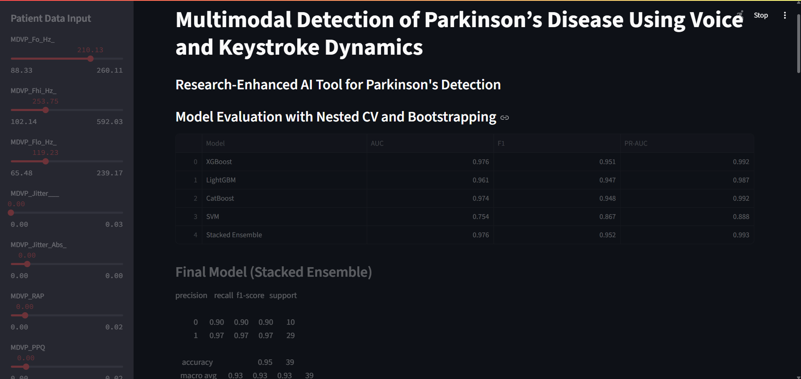
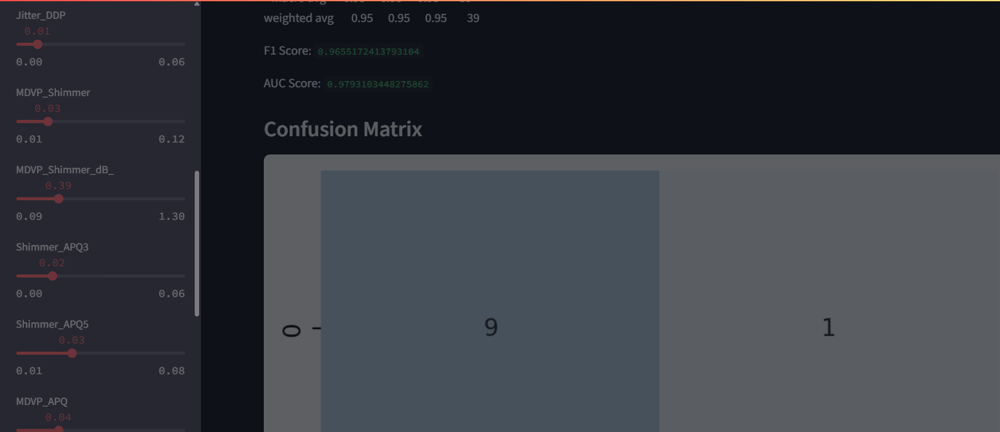
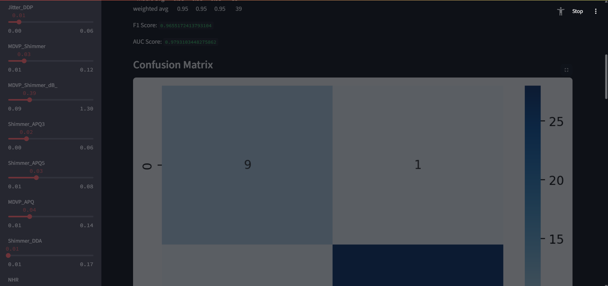
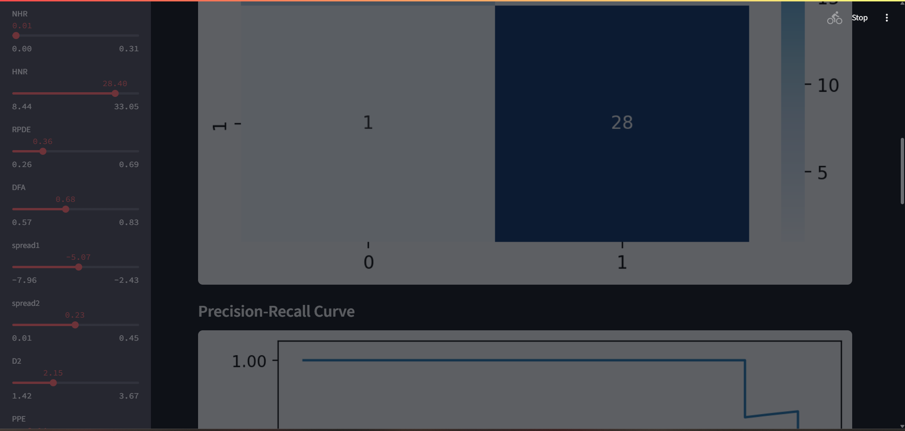
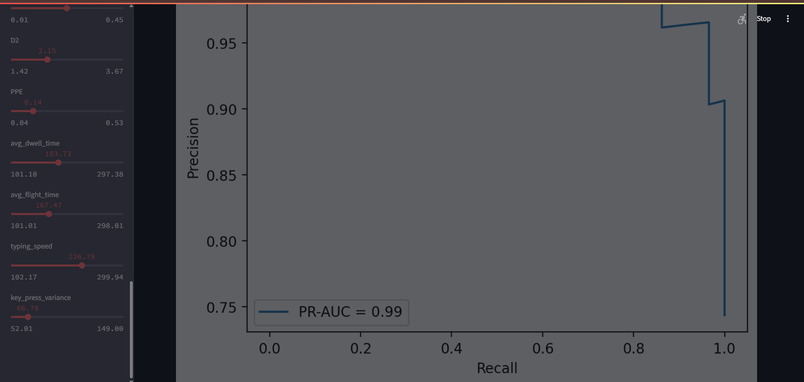
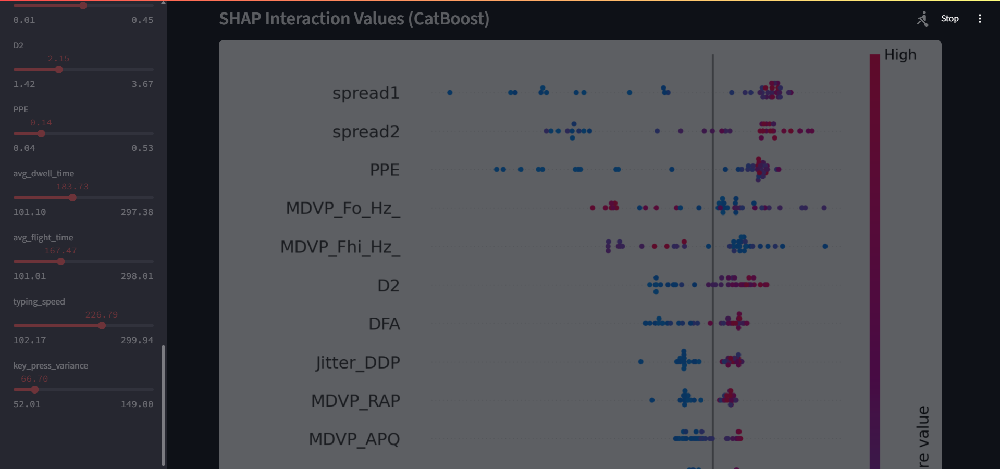
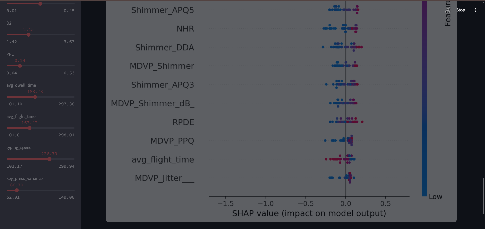
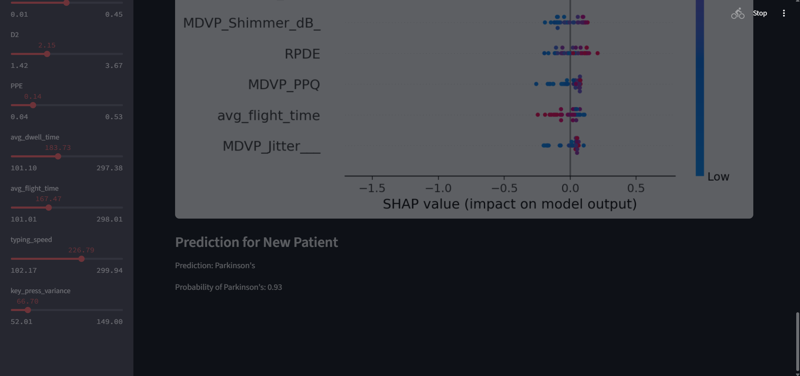

# -Multimodal-Detection-of-Parkinson-s-Disease-Using-Voice-and-Keystroke-Dynamics

This repository presents a research-driven, interactive **Streamlit web application** for the **early detection of Parkinson’s Disease** using **multimodal features**—namely **voice-based biomedical signals** and **simulated keystroke dynamics**. The system leverages ensemble machine learning techniques, model interpretability tools, and a clean UI for both demonstration and diagnostic purposes.It is designed to be run in environments like Google Colab using ngrok for public tunneling.

---

##  Objectives

The core aims of this project are:

- To simulate a **multimodal detection pipeline** combining voice data and typing behavior to improve diagnostic accuracy for Parkinson’s Disease.
- To **compare and evaluate** multiple state-of-the-art models (XGBoost, LightGBM, CatBoost, SVM).
- To construct a robust **Stacking Ensemble** for improved generalizability.
- To incorporate **nested cross-validation and bootstrapping** for unbiased evaluation.
- To utilize **SHAP (SHapley Additive exPlanations)** for feature importance and interpretability.
- To build a **user-interactive system** that accepts patient data and outputs real-time predictions with probability scores.

---

## ✨ Features

- ✅ Multimodal feature integration (voice + simulated keystroke data)
- ✅ Clean Streamlit interface for medical tech demonstration
- ✅ Models supported: `XGBoost`, `LightGBM`, `CatBoost`, `SVM`
- ✅ Ensemble learning via `StackingClassifier`
- ✅ Evaluation via:
  - ROC AUC, F1 Score, PR-AUC
  - Confusion Matrix
  - Precision-Recall Curve
- ✅ Model interpretability with SHAP summary plots
- ✅ Real-time patient data input and prediction output

---
## 📌 Discussion

This tool is intended to serve as a prototype diagnostic aid, exploring the synergy between speech biomarkers and fine motor control (typing patterns), especially relevant for Parkinson’s. While the keystroke features are simulated for now, real-world typing data could significantly enhance the clinical relevance of such multimodal systems.

By combining model ensemble techniques and interpretability layers like SHAP, the application not only predicts but explains the basis for its decisions, supporting trust in medical AI deployments.

---

## 📊 Dataset

The primary dataset used is the **UCI Parkinson's Telemonitoring Voice Dataset**:

🔗 [UCI Parkinson’s Dataset](https://archive.ics.uci.edu/ml/machine-learning-databases/parkinsons/parkinsons.data)

Additional **keystroke-based features** (e.g., dwell time, flight time, typing speed) are synthetically generated for simulation purposes in this study.

---

## 🚀 How to Run This in Google Colab

1. **Clone or Download** the `.py` file from this repository.
2. Open the script in [Google Colab](https://colab.research.google.com/).
3. Install the required packages:
4. Create an ngrok account:
   Sign up at ngrok.com
5. Add your ngrok authtoken
6. Run the Streamlit App and expose it

---

## 📷 App Preview

Here are some snapshots of the web application in action:

  
  

  
  

  
  

  
  

---
## 📜 License

This project is licensed under a custom "All Rights Reserved" license by ADWAITA PATANE.

Please do not reproduce, distribute, or modify the code without explicit permission.

© 2025 ADWAITA PATANE. – All Rights Reserved.

